# Matrix-Using-Linked-Lists-Arrays

## Matrix Using Linked Lists & Arrays
Inspired after reading about Sparse Matrix, I decided to implement a matrix using two arrays of linked lists.
This structure is useful when the matrix is sparse, i.e., when most of the elements are zero.
And also usefull when wanting to transpose the matrix.

will be represented as:

```mermaid

graph TD
    Matrix(Matrix) --> Rows[Row List Array]
    Matrix --> Cols[Column List Array]

    subgraph Row_Lists
        Rows --> Row1[Row 1]
        Row1 --> Node1_0((1))
        Node1_0 --> Node1_1((2))
        Node1_1 --> Node1_2((3))
        Rows --> Row2[Row 2]
        Row2 --> Node2_0((4))
        Node2_0 --> Node2_1((5))
        Node2_1 --> Node2_2((6))
    end
    
    subgraph Column_Lists
        Cols --> Col1[Col 1]
        Col1 --> Node1_0
        Node1_0 -.-> Node2_0
        Cols --> Col2[Col 2]
        Col2 --> Node1_1
        Node1_1 -.-> Node2_1
        Cols --> Col3[Col 3]
        Col3 --> Node1_2
        Node1_2 -.-> Node2_2
    end

    classDef row_list margin-right:6cm
    classDef col_list margin-left:6cm
    classDef matrix fill:#bbf,stroke:#333,stroke-width:1px;
    classDef list fill:#f9f,stroke:#333,stroke-width:1px;
    classDef array fill:#ff9,stroke:#333,stroke-width:1px;
    class Matrix matrix;
    class Rows,Cols array;
    class Row1,Row2,Col1,Col2,Col3 list;
    class Row_Lists row_list
    class Column_Lists col_list
   

```

